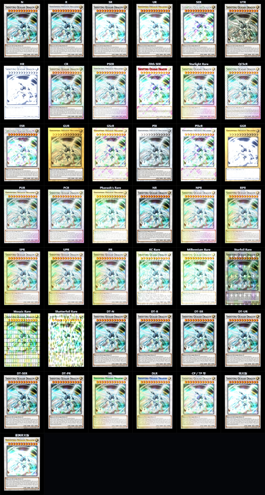
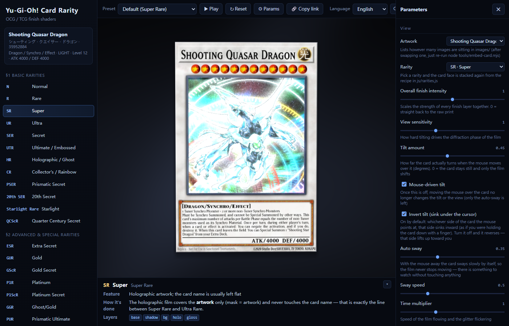
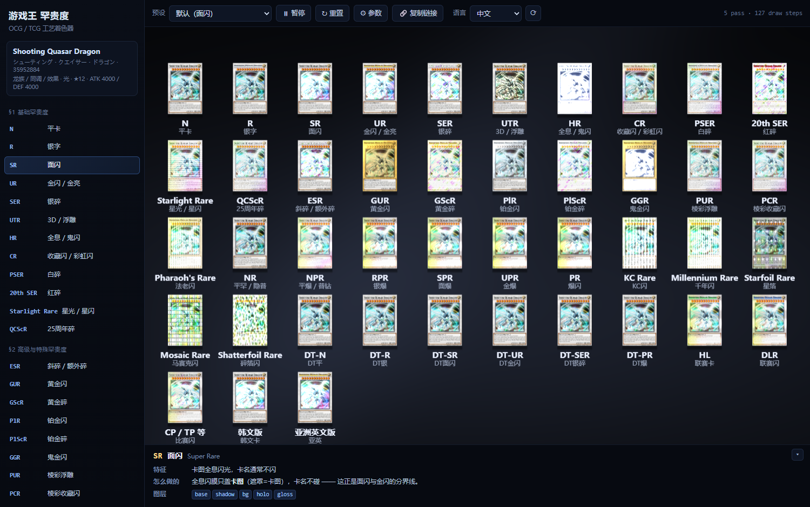
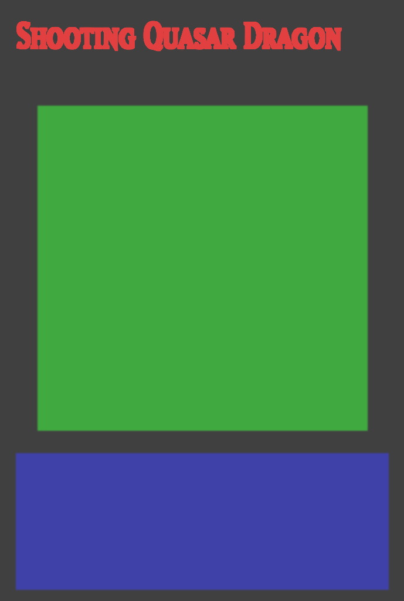

# 游戏王 罕贵度 · 工艺着色器

**一张真实的游戏王卡 + 43 条罕贵度的工艺着色器。**

卡图是你给的 `images/Shooting Quasar Dragon.jpg` —— **Shooting Quasar Dragon**
（龙族 / 同调 / 效果 · 光 · ★12 · ATK 4000 / DEF 4000）。

罕贵度不是随便编的：**每一个都对应
[`docs/游戏王罕贵度总结（OCG  TCG）.md`](docs/游戏王罕贵度总结（OCG%20%20TCG）.md) 里的一条**，
文档里写"卡图全息闪光，卡名通常不闪"就渲染成"闪膜只盖卡图"，
写"卡名部分为银色烫金"就只给卡名笔画烫银。

**卡图可以换** —— `images/` 下有几张就认几张，参数面板最上面那个「卡图」下拉框里选。
新丢一张图进去**不用跑 node**：点下拉框左边的 **⟳** 就能当场烤出来（详见下面「加一张新卡图」）。
**界面有中文 / English / 日本語**，右上角切。

| 想看的 | 去哪儿 |
| --- | --- |
| 一页读完（43 条速查表 / 做不出来的 / 验证结论） | **[`docs/总结.md`](docs/总结.md)** |
| 实现细节（架构 / 掩膜 / 17 个着色器逐个 / 43 条配方 / 换卡 / 多语言） | **[`docs/rarity-shaders.md`](docs/rarity-shaders.md)** |



界面（中文 / English / 日本語 三语）：



---

## 怎么跑

**直接双击 `index.html`** —— 无外部依赖、无需构建、`file://` 下即可运行。

> 页内脚本都是**经典 script**（不是 ES module）。卡图与掩膜是**以 data URI 内嵌**的，
> 不是 `file://` 读本地图片 —— Chrome 把每个本地文件当独立来源，用本地 `` 做
> `texImage2D` 会因"来源不干净"被拒。

用本地服务也行：

```powershell
cd "E:\ZG\Documents\DeepSeekHarness\P5.js\Art\Yu-Gi-Oh Card Rarity"
python -m http.server 8020      # 然后打开 http://localhost:8020
```

| 操作 | 效果 |
| --- | --- |
| **鼠标移到卡片上** | 卡片**真的绕 X/Y 轴转**（顶点着色器的 3D 倾斜），闪膜的衍射相位跟着这两个角度走 —— 拿实卡看闪膜本来就是捏着卡慢慢转。**默认鼠标指到哪、那一侧就往里沉**（像手指按住卡片），想换成"那一侧朝你翘"就把面板里的「倾斜反向」关掉 |
| 左侧列表 | 43 条罕贵度，按文档的五个分节分组；条目右边的小标签标出"与某条同工艺" |
| 说明条 | 当前罕贵度的**文档原话**（特征）与**怎么做的**（对应哪几个着色器） |
| <kbd>空格</kbd> / 「⏸ 暂停」 | 暂停 / 继续（暂停时改参数立刻重绘） |
| <kbd>R</kbd> / 「↻ 重置」 | 时钟归零 |
| <kbd>P</kbd> / 「⚙ 参数」 | 参数面板（53 个参数 / 4 组：观看 / 工艺 / 区域 / 调试） |
| <kbd>M</kbd> | 掩膜调试图层 |
| 预设 | **23 个**：默认 / 各单个罕贵度 / ★掩膜调试 / ★区域回到烘焙值 / ★图案图集 / ★★一览全部罕贵度 / ★★纯卡面 |
| 「🔗 复制链接」 | 把当前 53 个参数写进地址栏 hash 并复制 |
| 右上角「语言」 | 中文 / English / 日本語 即时切换，选择记在 localStorage 里；「⟳」重新扫描 `Languages/` 下新丢进来的语言包 |
| 说明条右上「▾」 | 收起 / 展开说明条（收起状态也会记住） |
| 面板最上面「卡图」 | 换一张已经烤好的卡（有几张列几张） |
| 「卡图」下拉框左边的 **⟳** | **加一张新卡图**：扫 `images/` 找出还没烤过的图，当场烤出来加进下拉框。`file://` 下浏览器不给读目录，会弹文件选择框让你手动选（<kbd>Shift</kbd> + 点击 = 强制手动选） |

---

## 加一张新卡图

把图片丢进 `images/`（文件名就是卡 id），然后二选一：

| | 怎么做 | 结果 |
| --- | --- | --- |
| **临时看一张** | 打开页面，点「卡图」下拉框左边的 **⟳** | 浏览器里**当场烤**出来，立刻能选。只活在这一份内存里，**刷新页面就没了** |
| **长期留下** | `node tools/embed-card.mjs` | 重新生成 `js/card-textures.js`（7 张卡约 4 分钟），并发到 `assets/` 归档；之后每次打开都在 |

**为什么 ⟳ 不是"重新读一遍目录"那么简单**：下拉框列的是 `js/card-textures.js`，而卡图不是直接读 `images/` 的
—— 每张卡还需要一张**工艺区域掩膜**（卡名笔画靠 Otsu 从图里抠、插画与效果框的矩形要按卡片外沿映射），
这些是烘焙时算出来的。所以 ⟳ 必须**把烘焙跑一遍**，它调的就是 `js/bake.js` —— 与 `embed-card.mjs` 同一份实现。

两条路的差别只在"怎么知道有新图"：

- `http://`（`python -m http.server`）→ `fetch('images/')` 读目录索引，自动发现新图，全自动
- `file://`（双击打开）→ 浏览器**不允许**列目录，而且 file:// 的图会让 canvas 变"脏"、`getImageData` 直接抛
  `SecurityError`（整个项目就是为了绕开这条才把卡图内嵌成 data URI 的）。所以改成弹文件选择框，
  用 `FileReader` 读成 data URI 再烤 —— 用户主动选的文件不带来源限制

---

## 17 个工艺

每一条罕贵度就是**一串图层**，每个图层是一个工艺着色器。
具体参数（`uP0`/`uP1`/`uP2` 的含义、用在哪些罕贵度、实测改动量）见
[`docs/rarity-shaders.md` §5](docs/rarity-shaders.md)。

| 类别 | 工艺 | 干什么 |
| --- | --- | --- |
| **闪膜** | `holo` | 宽光带全息（面闪的底子） |
| | `parallel` | 极细平行线光栅，倾斜时整片彩虹一起扫过去（爆闪） |
| | `diagonal` | 斜光栅 + 沿栅格随机的碎片色相，裂纹发白（银碎） |
| | `prismatic` | 正反两个方向的细光栅交叉，交叉点炸白（白碎） |
| | `starfoil` / `mosaic` / `voronoi` | 星箔 / 马赛克 / 碎箔 |
| **图案** | `kc` / `millennium` / `stamp` | 电路板膜（成组的长走线 + 45° 折角 + 过孔 + 留白，**鼠标附近那一块显形，窗口 ≈45%、对焦最亮往外渐变**）/ 埃及象形字图案膜（另加全图小金点，一个角度最多显形 20%）/ 20th·25th 水印 —— 见 `docs/rarity-shaders.md` §4 |
| **工艺** | `emboss` | 把卡面明暗当高度场求梯度得法线，再用方向光打亮（浮雕） |
| | `ghost` | 银白幽灵（鬼闪）：只压**怪物图框**，某些角度会滑成面闪 |
| | `metal` | 金 / 铂金箔：明暗**映射**到金属色 + 拉丝高光 |
| | `rainbow` | 以高光点为圆心按极坐标取色相，跟着鼠标转（收藏闪） |
| | `name` | 卡名笔画烫金 / 烫银 / 换色 |
| **加光** | `glitter` / `gloss` | 细碎亮点 / 扫光（这两个走加法混合） |

外加 4 个基础件（`base` `shadow` `bg` `maskdebug`）= **21 个片段着色器**，
以及一个 **3D 倾斜顶点着色器**。

### 43 条罕贵度

| 分节 | 条数 | 有代表性的几条 |
| --- | --- | --- |
| §1 基础 | 12 | `N` 平卡 · `R` 银字 · `SR` 面闪 · `UR` 金闪 · `SER` 银碎 · `UTR` 浮雕 · `HR` 鬼闪 · `CR` 收藏闪 · `PSER` 白碎 · `20th SER` 红碎 · `Starlight` 星光 · `QCScR` 25周年碎 |
| §2 高级特殊 | 10 | `ESR` 斜碎 · `GUR` 黄金闪 · `GScR` 黄金碎 · `PlR` 铂金闪 · `GGR` 鬼金闪 · `PUR` 棱彩浮雕 · `PCR` 棱彩收藏闪 · `Pharaoh's` 法老闪 · `NR` 平罕 |
| §3 平行 / 爆闪 | 10 | `NPR` 平爆 · `RPR` 银爆 · `SPR` 面爆 · `UPR` 金爆 · `PR` · `KC` · `Millennium` 千年闪 · `Starfoil` · `Mosaic` · `Shatterfoil` |
| §4 Duel Terminal | 6 | `DT-N` ~ `DT-PR`（工艺与 OCG 同名一致，用 `like:` 指向，不抄一遍） |
| §5 其他 | 5 | `HL` 联赛卡 · `DLR` 联赛闪 · `CP/TP` 比赛闪 · 韩文版 · 亚洲英文版 |



---

## 它是怎么做出来的

### 卡面被切成四块

罕贵度的差别**几乎全在"哪一块被加工了"**上，所以先把这张卡切成几块
（数字是 `tools/probe-card.mjs` 打亮度剖面量出来的，不是抄的规格表）：

| 区域 | 说明 | 占比 |
| --- | --- | --- |
| **卡名笔画** | 卡名带里**按暗度抠出来**再膨胀 2px —— 不猜字形位置，换任何字体都跟得住 | 2.30% |
| **卡图** | 插画本身（不含四周深色框） | 44.2% |
| **效果框** | 含 ATK/DEF 带 | 21.0% |
| **卡框** | 整卡 − 卡图窗外框 − 效果框（着色器按矩形现算） | 29.7% |
| 卡图外环 | 卡图窗外框 − 卡图内容 | 5.1% |

掩膜通道分配与"卡图的四块区域怎么定"的细节见 [`docs/rarity-shaders.md` §3](docs/rarity-shaders.md)。



### 一次踩坑：部分覆盖的层会把整张卡重画一遍

`name` 只加工卡名笔画，所以很自然地写成 `if (mask < 0.004) return tex;`。
但返回的 `tex` 带着 `tex.a`（卡内恒为 1），**等于这一层把整张卡重画了一遍** ——
它会在上一层的成果上面把原始印刷重新贴回来。表现是"怎么调都不对"而且完全不报错：

- 黄金闪的边框怎么调都不变金（`metal` 刷成金箔后，`name` 一层把它抹回银色）
- 浮雕叠三层只剩最后一层起作用
- 白碎只剩闪粉和白色卡名，棱彩膜整个不见了

改成"**覆盖度当 alpha**"就好了：`mask = 0` 的地方 alpha = 0，那一片什么都不画。
细节见 [`docs/rarity-shaders.md` §6](docs/rarity-shaders.md)。

### 还有一个：canvas 的预乘 alpha 会吃掉掩膜

第一版把"卡框掩膜"放进 alpha 通道，于是卡图窗与效果框那两块（卡框掩膜 = 0 → alpha = 0）
的 G/B 通道在**反预乘**时被除以 0 抹掉了 —— 而且画面看着完全正常，
因为 GPU 上传走的是 `` 里的原始像素、不经过 canvas。
现在 alpha 让给"是不是卡上的像素"，`tools/verify.mjs` 里专门有一条盯这个往返。

### 3D 倾斜

```
p = 卡片局部坐标 → 绕 Y 轴转 → 绕 X 轴转 → 透视投影
gl_Position.w = z / dist        ← 不是 1，这样纹理坐标按透视插值，卡面不会错位
uView = f(tilt.x, tilt.y)       ← 同样这两个角度驱动闪膜的衍射相位
```

鼠标在卡面上的位置决定倾斜角，于是"看闪膜"这件事才和实卡的手感对得上。

---

## 验证

```powershell
cd "E:\ZG\Documents\DeepSeekHarness\P5.js\Art\Yu-Gi-Oh Card Rarity"
node tools/verify.mjs        # 63 项自检
node tools/effects.mjs       # 43 个罕贵度 + 17 个工艺 + 53 个参数 + 23 个预设实测
node tools/doc-check.mjs     # 核对两份文档里可机器判定的说法（56 项）
node tools/gen-doc.mjs       # 改了 rarities.js 之后重填文档里的表
```

### `tools/verify.mjs` —— 63 项全 PASS

```

-- A. 归档一致性 --
  PASS  生成物里记的每张卡 SHA-256 都与 assets/ 里的归档一致  —— 7 张全部一致
  PASS  images/ 里的原始卡图与 assets/ 归档一致（没被改过）  —— 6f4313494a38e490…
  PASS  归档文件用的是新文件名（35952884.jpg 已改名）  —— assets/Shooting Quasar Dragon.jpg

-- B. 纹理与掩膜 --
  PASS  掩膜从 data URI 解回来后的覆盖率与生成时记录一致（误差 < 0.5%）  —— 卡名 1.85% · 卡图 40.7% · 效果框 18.9% · 卡框 37.2%
  PASS  卡图 / 效果框掩膜能挺过一次 canvas 往返（预乘 alpha 没把它们抹掉）  —— 卡图 40.7% 效果框 18.9%
  PASS  四个区域加起来 ≈ 整张卡（差的那点是圆角与羽化边）  —— 合计 100.0% · 外环 3.2%
  PASS  卡片剪影（alpha 通道）在卡内处处为 1  —— 100.00%
  PASS  纹理尺寸与留白自洽（内容 = 纹理 ×(1−2×留白)）  —— 813×1185，留白 0%，圆角 0px
  PASS  卡片长宽比接近实卡的 59:86 = 0.6860  —— 实测 0.6717

-- C. 掩膜语义 --
  PASS  "卡名笔画"掩膜确实落在字上（与底板明显分离，方向符合自动判出的极性）  —— 极性 深字浅底 · 笔画区 0.190 vs 底板 0.361（分离 0.171，笔画 17871 px）
  PASS  卡名笔画占比合理（1% ~ 6%）  —— 1.85%
  PASS  卡图窗占比合理（35% ~ 55%）  —— 40.7%
  PASS  效果框占比合理（15% ~ 28%）  —— 18.9%
  PASS  卡框占比合理（20% ~ 40%）  —— 37.2%
  PASS  每张卡的卡名笔画占比都在 1% ~ 6%（没有哪张被整条名带填满）  —— A-to-Z-Dragon Buster 1.85% · Blue-Eyes Chaos MAX  1.88% · Meklord Astro Mekani 1.85% · Odin, Father of the  1.68% · Raidraptor - Rising  2.07% · Shooting Quasar Drag 1.81% · The First Darklord 1.61%
  PASS  每张卡的卡名极性都是自动判出来的，且两类亮度差够（≥ 0.12）  —— A-to-Z-Dragon Buster 深字浅底/0.318 · Blue-Eyes Chaos MAX  深字浅底/0.426 · Meklord Astro Mekani 深字浅底/0.419 · Odin, Father of the  深字浅底/0.815 · Raidraptor - Rising  白字黑底/0.741 · Shooting Quasar Drag 深字浅底/0.808 · The First Darklord 深字浅底/0.332

-- D. 罕贵度表 --
  PASS  罕贵度 id 唯一  —— 43 条
  PASS  LIST 与 ORDER 长度一致  —— 43 / 43
  PASS  每个图层引用的着色器都存在  —— 全部命中
  PASS  每条罕贵度都有"怎么做的"说明  —— 43 条都有
  PASS  图层参数合理（强度 > 0、遮罩码在 0..10）  —— OK
  PASS  每个工艺着色器都被至少一个罕贵度用到  —— 17 个工艺全部用上
  PASS  着色器清单齐备（工艺 17 + 基础 4）  —— 工艺 17 · 合计 21 个片段着色器
     分节: base=12 · high=10 · parallel=10 · dt=6 · other=5

-- E. 着色器编译与出图 --
  PASS  全部片段着色器编译通过  —— 21 个
  PASS  每个罕贵度都能出图（卡片区非全黑）  —— 最低 108.5
     GPU: ANGLE (Google, Vulkan 1.3.0 (SwiftShader Device (Subzero) (0x0000C0DE)), SwiftShader driver)

-- F. 确定性 --
  PASS  同一时间点重复渲染逐字节一致  —— 最大差 0
  PASS  时间推进后画面确实变了（时钟接通了闪膜的流动）  —— t=0 vs t=9 卡片区平均差 12.43（全屏 6.96）
  PASS  自动摆动真的在动  —— 摆动 0s vs 4s 平均差 21.19

-- G. 视角 / 倾斜 --
  PASS  鼠标左右移动会改变画面（3D 倾斜 + 衍射相位）  —— 平均差 21.23，最大 220
  PASS  倾斜幅度 = 0 时鼠标不动画面  —— 最大差 0
  PASS  关掉"鼠标驱动倾斜"后鼠标不动画面  —— 最大差 0

-- H. 布局：开合参数面板不能改变卡片的显示大小 --
  PASS  关着面板：画布 CSS 尺寸 = 绘制缓冲区尺寸  —— CSS 1012 · 缓冲区 1012 · 舞台 1012
  PASS  打开面板：舞台确实变窄了（否则这条检查没意义）  —— 1012 → 700
  PASS  打开面板后画布跟着重新分配尺寸（不是被 CSS 缩小）  —— CSS 700 · 缓冲区 700
  PASS  关掉面板后画布恢复到原尺寸  —— 1012
  PASS  卡片长宽比始终等于纹理长宽比（没有被拉伸）  —— 0.6861 vs 纹理 0.6861（A-to-Z-Dragon Buster Cannon）
  PASS  舞台很窄（420px）时卡片仍然整张在画面里，四边都没顶到画布边  —— 画布 420×656 · 卡片 416×606 · 非黑像素 x 2..417 y 25..630

-- I. 倾斜方向 --
  PASS  倾斜反向默认打开：鼠标那一侧往里沉（那一侧投影边界往中间收）  —— 鼠标在右 [78, 541] · 鼠标在左 [98, 560]
  PASS  关掉「倾斜反向」：方向确实反过来（那一侧朝你翘）  —— 鼠标在右 [98, 560] · 鼠标在左 [78, 541]
  PASS  两种方向确实是不一样的两幅画面（不是符号写反了却互相抵消）  —— 右边界 541 vs 560（差 19px）

-- J. hash 编解码 --
  PASS  hash 编解码往返一致  —— 53 个参数 → 193 字符
  PASS  非法/越界输入被丢弃或夹紧

-- K. 卡片外沿自动识别（合成用例） --
     识别  铺满整图  ·  both-axes  ·  长宽比 0.6711  ·  四边误差 [3, 3, 1, 1]
     识别  浅背景 + 投影（卡片占 47% 宽）  ·  both-axes  ·  长宽比 0.6703  ·  四边误差 [2, 0, 1, 1]
     识别  深背景 + 投影  ·  both-axes  ·  长宽比 0.6948  ·  四边误差 [0, 0, 1, 17]
     识别  浅背景 + 无投影（最难）  ·  both-axes  ·  长宽比 0.6740  ·  四边误差 [0, 0, 1, 1]
  PASS  铺满整图的卡：识别出的外沿就是整张图  —— 最大误差 3px
  PASS  浅背景 + 投影（卡片只占 47% 宽）：能识别出来，且四边误差 ≤ 20px  —— 最大误差 2px（用 both-axes）
  PASS  深背景 + 投影：能识别出来，且四边误差 ≤ 25px  —— 最大误差 17px
  PASS  浅背景 + 无投影（最难的一种）：仍然不会崩（要么认对，要么老实地退化）  —— 最大误差 1px
  PASS  识别出的长宽比都在游戏王卡的 59:86 附近（±0.03）  —— 0.6711 · 0.6703 · 0.6948 · 0.6740

-- L. 多卡图 --
  PASS  images/ 下的每张卡都进了 CardTextures  —— 7 张：A-to-Z-Dragon Buster Cannon · Blue-Eyes Chaos MAX Dragon · Meklord Astro Mekanikle · Odin, Father of the Aesir · Raidraptor - Rising Rebellion Falcon · Shooting Quasar Dragon · The First Darklord
  PASS  生成物里的卡数与 images/ 下的图片数一致  —— 7 张
  PASS  卡片外沿是自动识别出来的，且比例像游戏王卡（0.60~0.78）  —— A-to-Z-Dragon Buster Cannon: 识别 0.6717 · Blue-Eyes Chaos MAX Dragon: 识别 0.6726 · Meklord Astro Mekanikle: 识别 0.6726 · Odin, Father of the Aesir: 识别 0.6726 · Raidraptor - Rising Rebellion Falcon: 识别 0.6717 · Shooting Quasar Dragon: 识别 0.6726 · The First Darklord: 识别 0.6717
  PASS  自动识别出的外沿与手工量的一致（这张卡是 26,26 → 787,1157，允许 ±3px）  —— 26,26 → 788,1159
  PASS  圆角不再烤进纹理（改由运行时的 uCardRound 控制）  —— 0px
  PASS  切到别的卡之后画面确实变了  —— A-to-Z-Dragon Buster Cannon 0.0 · Blue-Eyes Chaos MAX Dragon 45.7 · Meklord Astro Mekanikle 47.2 · Odin, Father of the Aesir 57.3 · Raidraptor - Rising Rebellion Falcon 53.1 · Shooting Quasar Dragon 57.5 · The First Darklord 34.5
  PASS  切回第 0 张能逐字节回到原样  —— 最大差 0

-- M. 多语言 --
  PASS  清单里的每个语言包都加载成功  —— zh-CN✓ en-US✓ ja-JP✓
  PASS  每个语言包的键集合与 zh-CN 完全一致  —— zh-CN 329 键 · en-US 329 键 · ja-JP 329 键
  PASS  切换语言后界面文案真的变了（标题 / 罕贵度名 / 分节 / 参数组 / 预设）  —— zh-CN: 平卡 / 观看 · en-US: Normal / View · ja-JP: ノーマル / 表示
  PASS  缺键回退到 zh-CN（不是显示裸键）  —— 中文兜底
  PASS  所有语言都没有的键才回退成键名本身  —— __definitely_missing__
  PASS  切语言记进了 localStorage  —— stored=zh-CN

-- N. 控制台 --
  PASS  页面无未捕获异常  —— 无
  PASS  控制台无 error  —— 无

-- O. 出图 --
  PASS  截图写出  —— E:\ZG\Documents\DeepSeekHarness\P5.js\Art\Yu-Gi-Oh Card Rarity\tools\.cache\verify-preview.png

RESULT: PASS  （63 项）
```

### `tools/effects.mjs` —— 43 + 17 + 53 + 23 全部实测

```
-- ① 每个罕贵度相对"平卡 N"改了什么 --
  罕贵度        图层                        均值差   变化像素
  N            （无）                       0.00     0.0%     ← 本来就与平卡完全相同
  R            name                         3.40     2.4%
  SR           holo+gloss                  23.97    41.0%
  UTR          emboss+emboss+emboss        17.77    49.6%
  HR           ghost+emboss                12.31    40.6%     ← 幽灵只压怪物图框（卡图占 44%）
  GUR          metal+metal+name            31.70    81.2%
  KC Rare      holo+gloss+name+kc           17.25    48.8%     ← 鼠标附近那一块显形（≈45%）
  Millennium   millennium                   8.00    21.9%     ← 一个角度只显形 20% 上下
  NR           （无）                       0.00     0.0%     ← 本来就与平卡完全相同

-- ② 逐工艺单独作用（借 SR 的位置，只留这一层）--
  holo 20.27 · parallel 35.37 · diagonal 24.01 · prismatic 40.44 · starfoil 23.50
  mosaic 39.08 · voronoi 49.47 · kc 3.80 · millennium 7.23 · emboss 16.16
  ghost 24.90 · metal 21.41 · rainbow 10.92 · name 3.09 · glitter 1.12 · stamp 0.91 · gloss 5.52
  ↑ glitter / stamp / name 是"小面积但很强"（单通道最大差 80~255），所以均值差看着小；
    kc / millennium / ghost 现在也小 —— 前两个**只显形一部分**（45% / 20%），
    ghost 只压怪物图框，都是设计要求（见 §4 图案膜的"可见窗口"）

RESULT: 罕贵度 / 工艺 / 预设全过 · 参数 39/53 接通（14 个「区域」+「卡图」是扫描工况的问题）
```

> 判定"某参数是否接通"用的是**卡片区与全屏两个区域的逐像素差**，认可三种情形：
> 大面积温和变化（均值差 > 0.6）、小面积较强变化（> 0.4% 像素且单通道差 > 24）、
> 极小面积极强变化（单通道差 > 60 —— 白闪、扫光这类只有一小块亮起来）。
> 有些参数是**周期函数的相位**，所以对 float 参数会试几个候选值取效果最明显的那个。

---

## 验证过程中真改掉的东西

这几条都是工具抓出来的，肉眼看画面发现不了：

1. **部分覆盖的层把整张卡重画一遍** —— `effects.mjs` 的"逐工艺单独作用"扫出来的：
   `mHolo` 调成 0 画面一点变化都没有。其实不是参数没接通，是**合成模型错了**（见上文）。
2. **"关掉鼠标驱动倾斜"之后定格画面照样跟着鼠标跑**
   —— `renderAtTime` 里另抄了一份倾斜计算、抄的时候漏了 `hoverOn` 判断
   （实测鼠标左右移动仍有 **252** 的单通道最大差）。现在实时与定格共用一个 `targetTilt()`。
3. **hash 里的 `'0'` 被读成"开"** —— `clampParam` 对 check 型写的是 `v ? 1 : 0`，
   而 hash 解出来的是字符串，`'0'` 在 JS 里是**真值**。改成 `Number(v) ? 1 : 0`。
4. **canvas 的预乘 alpha 吃掉了掩膜** —— 见上文。
5. **`nameTintOn` 打开等于没打开** —— 默认的卡名颜色 `#d8e4ff` 和"银字"的银色几乎一样，
   逐参数扫描直接判它"没接通"。换成明显不同的青色。
6. **`shadowOn` 被判成"没接通"** —— 不是因为投影没画，而是投影偏移只有 1% 画布高、
   几乎全藏在卡片背后。加大到 1.7% / 1.032 倍之后才真的看得见。
7. **倾斜的两个轴方向是相反的** —— 鼠标往右是"右边朝你翘"，鼠标往下却是"下边往里沉"。
   单看一个方向都说得通，斜着晃鼠标就发现两边在打架。现在统一由「倾斜反向」控制，
   默认是"鼠标指到哪、那一侧往里沉"。
8. **打开参数面板卡片会变小** —— 画布只监听了 window 的 `resize`，而面板开合改的是 CSS grid，
   没有 window 事件。stage 变窄后画布还是原来的尺寸、被 CSS 缩着显示。改用 `ResizeObserver` 盯 stage。
9. **卡面扫光有 40% 时间是死的** —— `gloss` 用 `max(sin, 0)` 做扫光带，
   扫过去的那段时间整层一点都不亮（实测 t=2~5s 整整四秒卡片区平均差正好是 0）。
   改成 `abs(sin)` + 一层常驻底光。

---

## 已知取舍（没有藏起来）

- **做不出来的那几条**：`NR` 平罕的唯一特征是**封入率**（与平卡在画面上完全一样，
  本项目一个像素都不改）；`UTR` 的"触摸有凹凸"渲染不出来；`CP/TP` 文档自己就说"版本差异大"，
  只给一个示意配方；韩文版 / 亚英不是新工艺而是**发行版本**。
  完整清单和理由见 [`docs/rarity-shaders.md` §8](docs/rarity-shaders.md)。
- **千年闪 / 法老闪的"埃及文字"是风格化近似**，不是考据过的圣书体字形 ——
  用 canvas 2D 现画了 4 个象形字（安卡 / 荷鲁斯之眼 / 王名圈 / 水波鸟）按格随机拼。
- **文档里没写清楚形状的那几条**（`Starlight` / `PSER` / `QCScR` 都说"整张卡覆盖闪膜"）
  按观感分别做成三种不同的膜，好让它们**看得出区别** —— 这是我定的，不是文档写的。
- **卡面上的套牌编号没有改**：那是印刷在卡上的东西，图上也没有，而且改它属于伪造卡面。
  罕贵度的代码显示在页面的说明条上。
- **本项目完全不做价格** —— 文档第 7 节也强调了"罕贵度不等于价格"。
- **换一张卡时，卡框 / 卡图窗 / 效果框那几个矩形是按游戏王**标准版式**写死的比例，所有卡共用。**
  同调怪、效果怪、通常怪都一样，但灵摆卡（多一个灵摆区）、连接怪（没有等级星）、
  无效果怪对不上，得在 `tools/embed-card.mjs` 顶部的 `CARDS` 表里按文件名覆盖。
  **卡名抠图还写死了"深字浅底"这个极性** —— 真正的金闪原图是金字压深红底，极性是反的，必须一起改。
- **语言包是 .js 不是 .json**：`fetch('./Languages/xx.json')` 在 `file://` 下会被 CORS 拦掉，
  而这个项目要求双击 index.html 就能跑。所以语言包写成一句 `CardI18nPack['xx'] = {...}`，
  用 `<script>` 注入加载。机制（localStorage / 缺键回退 / `{var}` 插值 / 下拉框即时切换）与
  隔壁 `Three.js-3D-Earth` 那份文档里写的一致，只有加载方式不同。
- **闪膜的动画（`uTime`）是我加的**：实卡不看不动，但屏幕上需要一点流动感才像"闪"。
  面板里可以把「时间倍率」调到 0。

---

## 出处与授权

- **着色器全部是我自己写的**，没有搬运任何游戏的着色器代码。
  组织方式（"一张精灵纹理 + 一遍遍往上叠的 draw step"、`texture_details` / `image_details`
  那套精灵协议）参考了隔壁 `card-shader/` 项目对 Balatro 渲染管线的总结：
  [`../card-shader/docs/balatro-shaders.md`](../card-shader/docs/balatro-shaders.md)。
- **卡图 `images/Shooting Quasar Dragon.jpg` 是你提供的**，我没有它的来源/授权信息；
  卡片本身与「遊☆戯☆王」相关的一切权利属于 **Studio Dice / SHUEISHA / TV TOKYO / KONAMI**。
  图上自带 "Replica - Not For Use in Sanctioned Tournaments" 水印。
  **仅供学习研究，不要商用**；对外分发前请自行确认授权。
- `js/`、`index.html`、`css/`、`tools/`、`docs/rarity-shaders.md`：我为这个项目写的，随你使用。
- `docs/游戏王罕贵度总结（OCG  TCG）.md` 是你给的原始文档，**我一个字都没有改**。

---

## 文件结构

```
Yu-Gi-Oh Card Rarity/
├── index.html
├── css/style.css
├── images/                      **卡图放这儿**，有几张就认几张（文件名即卡 id）
│   └── Shooting Quasar Dragon.jpg
├── assets/                      原图逐字节归档（verify 核对 SHA-256）
├── Languages/                   语言包，一个语言一个 .js
│   ├── languages.js             语言清单（加语言只改这里）
│   ├── zh-CN.js  en-US.js  ja-JP.js
│   └── 语言代码说明.txt
├── js/
│   ├── card-textures.js         **自动生成**：每张卡的卡图 + 掩膜（data URI）+ 区域表 + SHA-256
│   ├── detect.js                卡片外沿检测（页面与 tools/ 共用同一份）
│   ├── bake.js                  烘焙核心：纹理 + 工艺区域掩膜（页面与 tools/ 共用同一份）
│   ├── card-refresh.js          「卡图」左边那个 ⟳：扫 images/ 或选文件，当场烤出新卡
│   ├── i18n.js                  多语言加载器：t / tOr、localStorage、缺键回退 zh-CN
│   ├── stamps.js                图案图集：运行时用 canvas 2D 画 KC / 20th / 25th / 象形字
│   ├── shaders.js               17 个工艺 + 4 个基础件 + 3D 倾斜顶点着色器
│   ├── rarities.js              43 条罕贵度 → 着色器配方
│   ├── config.js                53 个参数 + 23 个预设 + hash 编解码
│   ├── pipeline.js              多 pass 管线、3D 倾斜、一览模式、取像接口
│   └── ui.js                    罕贵度列表 / 说明条 / 参数面板 / 语言下拉 / hash 同步
├── docs/
│   ├── 游戏王罕贵度总结（OCG  TCG）.md     原始文档（未改动）
│   ├── rarity-shaders.md                  **罕贵度 → 着色器**：架构 / 掩膜 / 着色器逐个 / 43 条配方
│   ├── 总结.md                            **一页总结**：43 条速查表 / 做不出来的 / 验证结论
│   └── mask-preview.png                   掩膜预览
├── tools/
│   ├── analyze-card.mjs         逐行/逐列边缘强度剖面
│   ├── probe-card.mjs           定点亮度剖面 + 放大裁片（量边界用）
│   ├── embed-card.mjs           卡图 + 掩膜烘焙（调 js/detect.js + js/bake.js，与页面同源）
│   ├── lib/detect.mjs           → js/detect.js 的源码文本
│   ├── lib/bake.mjs             → js/bake.js 的源码文本
│   ├── gen-doc.mjs              重填文档里自动生成的表
│   ├── doc-check.mjs            核对文档里可机器判定的说法
│   ├── verify.mjs               33 项自检
│   ├── effects.mjs              逐罕贵度 / 逐工艺 / 逐参数 / 逐预设实测
│   ├── gen-lang.mjs             从 js/ 里的文案生成 Languages/zh-CN.js
│   ├── shot.mjs / montage.mjs   取景 / 拼图
│   └── node_modules → 复用隔壁 card-shader 的 playwright-core（junction 链接）
└── preview.png / effects.jpg / sheet.png / panel.png / panel-en.png
```
